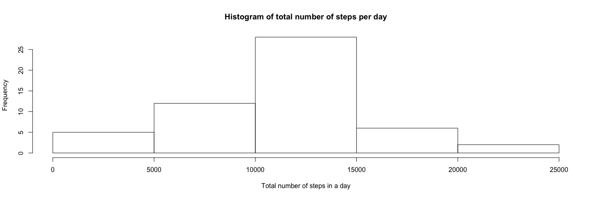
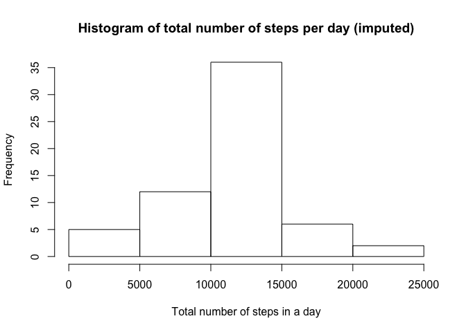
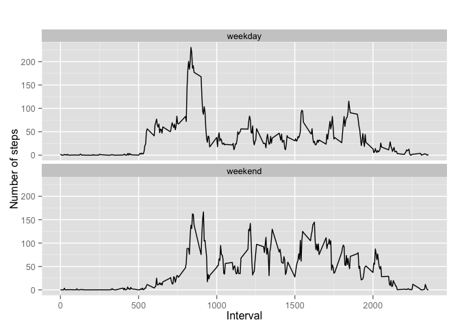

# Reproducible Research: Peer Assessment 1
Alexander Dolinin  
April 18, 2015  
=========================================  

>If not done so already, prepare your workspace (adjust code to your preferences and setup):

```r
# load all packages used in this exploratory analysis
library(knitr)
library(dplyr)
```

```
## 
## Attaching package: 'dplyr'
## 
## The following object is masked from 'package:stats':
## 
##     filter
## 
## The following objects are masked from 'package:base':
## 
##     intersect, setdiff, setequal, union
```

```r
library(ggplot2)

# set up YOUR working directory
setwd("~/Documents/ADdocuments/DataScience/repos/ReproducibleResearch/PA1/RepData_PeerAssessment1")
```

## Loading and preprocessing the data 
>**Dataset**: [Activity monitoring data](https://d396qusza40orc.cloudfront.net/repdata%2Fdata%2Factivity.zip) [52K]  
The variables included in this dataset are:  
         - **steps**: Number of steps taking in a 5-minute interval (missing values are coded as `NA`)  
         - **date**: The date on which the measurement was taken in YYYY-MM-DD format  
         - **interval**: Identifier for the 5-minute interval in which measurement was taken   
The dataset is stored in a comma-separated-value (CSV) file and there are a total of 17,568 observations in this dataset.

```r
## Download and unzip data
fileUrl <- "https://d396qusza40orc.cloudfront.net/repdata%2Fdata%2Factivity.zip"
fileLocal <- "activity.zip"
if (!file.exists(fileLocal)) {
        download.file(fileUrl, destfile=fileLocal, method="curl")
        unzip(fileLocal)
}
## Load raw data
data_raw <- read.csv('activity.csv')

# print 20 rows of raw data
head(data_raw,20)
```

```
##    steps       date interval
## 1     NA 2012-10-01        0
## 2     NA 2012-10-01        5
## 3     NA 2012-10-01       10
## 4     NA 2012-10-01       15
## 5     NA 2012-10-01       20
## 6     NA 2012-10-01       25
## 7     NA 2012-10-01       30
## 8     NA 2012-10-01       35
## 9     NA 2012-10-01       40
## 10    NA 2012-10-01       45
## 11    NA 2012-10-01       50
## 12    NA 2012-10-01       55
## 13    NA 2012-10-01      100
## 14    NA 2012-10-01      105
## 15    NA 2012-10-01      110
## 16    NA 2012-10-01      115
## 17    NA 2012-10-01      120
## 18    NA 2012-10-01      125
## 19    NA 2012-10-01      130
## 20    NA 2012-10-01      135
```

**Process/transform the data (if necessary) into a format suitable for your analysis** 

```r
## Remove NA in data
data <- data_raw[ with (data_raw, { !(is.na(steps)) } ), ]

# print 20 rows of processed data
head(data,20)
```

```
##     steps       date interval
## 289     0 2012-10-02        0
## 290     0 2012-10-02        5
## 291     0 2012-10-02       10
## 292     0 2012-10-02       15
## 293     0 2012-10-02       20
## 294     0 2012-10-02       25
## 295     0 2012-10-02       30
## 296     0 2012-10-02       35
## 297     0 2012-10-02       40
## 298     0 2012-10-02       45
## 299     0 2012-10-02       50
## 300     0 2012-10-02       55
## 301     0 2012-10-02      100
## 302     0 2012-10-02      105
## 303     0 2012-10-02      110
## 304     0 2012-10-02      115
## 305     0 2012-10-02      120
## 306     0 2012-10-02      125
## 307     0 2012-10-02      130
## 308     0 2012-10-02      135
```


## What is mean total number of steps taken per day?
>For this part of the assignment, you can ignore the missing values in the dataset.  
 1. Calculate the total number of steps taken per day  
 2. Make a histogram of the total number of steps taken each day  
 3. Calculate and report the mean and median of the total number of steps taken per day


```r
## 1. Calculate the total number of steps taken per day
by_day <- group_by(data_raw, date)
steps_by_day <- summarise(by_day, total = sum(steps))
# print a sample of this dataset
steps_by_day
```

```
## Source: local data frame [61 x 2]
## 
##          date total
## 1  2012-10-01    NA
## 2  2012-10-02   126
## 3  2012-10-03 11352
## 4  2012-10-04 12116
## 5  2012-10-05 13294
## 6  2012-10-06 15420
## 7  2012-10-07 11015
## 8  2012-10-08    NA
## 9  2012-10-09 12811
## 10 2012-10-10  9900
## ..        ...   ...
```


```r
## 2. Make a histogram of the total number of steps taken each day
hist(steps_by_day$total, main="Histogram of total number of steps per day", xlab="Total number of steps in a day")
```

 


```r
## 3. Calculate and report the mean and median of the total number of steps taken per day
summary(steps_by_day)
```

```
##          date        total      
##  2012-10-01: 1   Min.   :   41  
##  2012-10-02: 1   1st Qu.: 8841  
##  2012-10-03: 1   Median :10765  
##  2012-10-04: 1   Mean   :10766  
##  2012-10-05: 1   3rd Qu.:13294  
##  2012-10-06: 1   Max.   :21194  
##  (Other)   :55   NA's   :8
```
####Answer (with manually inserted values): Mean of total number of steps per day is 10766, median is 10765.  
  
Or, if you don't want to hunt for it in the summary output, you can do it like this:  

```r
# calculate mean and median
dailyStepMean <- mean(steps_by_day$total, na.rm=TRUE)
dailyStepMedian <- median(steps_by_day$total, na.rm=TRUE)
# insert them inline in an smart sentance, like the one below:
```
####Answer (with programmatically inserted values): Mean of total number of steps per day is 10766.1886792453, median is 10765.


## What is the average daily activity pattern?
>1. Make a time series plot (i.e. type = "l") of the 5-minute interval (x-axis) and the average number of steps taken, averaged across all days (y-axis)  
2. Which 5-minute interval, on average across all the days in the dataset, contains the maximum number of steps?

```r
## 1. Make a time series plot (i.e. type = "l") of the 5-minute interval (x-axis) and the average number of steps taken, averaged across all days (y-axis)

# preprocessing data for plot
steps_by_interval <- aggregate(steps ~ interval, data_raw, mean)

# create a time series plot 
plot(steps_by_interval$interval, steps_by_interval$steps, type='l', 
     main="Average number of steps over all days", xlab="Interval", 
     ylab="Average number of steps")
```

 


```r
# find row with max of steps
max_steps_row <- which.max(steps_by_interval$steps)

# find interval with this max
steps_by_interval[max_steps_row, ]
```

```
##     interval    steps
## 104      835 206.1698
```
####Answer: On average, the daily interval 835 has the maximum average value of steps (206.1698).


## Imputing missing values
>Note that there are a number of days/intervals where there are missing values (coded as NA). The presence of missing days may introduce bias into some calculations or summaries of the data.  
 1. Calculate and report the total number of missing values in the dataset (i.e. the total number of rows with NAs)  
 2. Devise a strategy for filling in all of the missing values in the dataset. The strategy does not need to be sophisticated. For example, you could use the mean/median for that day, or the mean for that 5-minute interval, etc.  
 3. Create a new dataset that is equal to the original dataset but with the missing data filled in.  
 4. Make a histogram of the total number of steps taken each day and Calculate and report the mean and median total number of steps taken per day. Do these values differ from the estimates from the first part of the assignment? What is the impact of imputing missing data on the estimates of the total daily number of steps?

```r
## 1. Calculate and report the total number of missing values in the dataset
sum(is.na(data_raw))
```

```
## [1] 2304
```
>####Answer: the total numver of missing values in the dataset is 2304.


```r
## 2. Strategy: replace NA’s with the mean for that 5-minute interval
data_imputed <- data_raw
for (i in 1:nrow(data_imputed)) {
        if (is.na(data_imputed$steps[i])) {
                interval_value <- data_imputed$interval[i]
                steps_value <- steps_by_interval[steps_by_interval$interval == interval_value,]
                data_imputed$steps[i] <- steps_value$steps
        }
}
```


```r
## 3. Create new data set data_no_na which equals to data_row but without NA’s. All NA’s are replaced with mean of 5-minute interval
## calculate  total number of steps taken each day
df_imputed_steps_by_day <- aggregate(steps ~ date, data_imputed, sum)
head(df_imputed_steps_by_day)
```

```
##         date    steps
## 1 2012-10-01 10766.19
## 2 2012-10-02   126.00
## 3 2012-10-03 11352.00
## 4 2012-10-04 12116.00
## 5 2012-10-05 13294.00
## 6 2012-10-06 15420.00
```


```r
## 4. Make a histogram of the total number of steps taken each day
hist(df_imputed_steps_by_day$steps, 
     main="Histogram of total number of steps per day (imputed)", 
     xlab="Total number of steps in a day")
```

 

```r
# calculate mean and median of imputed data
mean(df_imputed_steps_by_day$steps)
```

```
## [1] 10766.19
```

```r
median(df_imputed_steps_by_day$steps)
```

```
## [1] 10766.19
```

```r
# calculate mean and median of data without NA's
mean(steps_by_day$total, na.rm=TRUE)
```

```
## [1] 10766.19
```

```r
median(steps_by_day$total, na.rm=TRUE)
```

```
## [1] 10765
```
>#### Answer: Mean values stays the same, but there is slight difference in median value.


## Are there differences in activity patterns between weekdays and weekends?
>For this part the weekdays() function may be of some help here. Use the dataset with the filled-in missing values for this part.  
1. Create a new factor variable in the dataset with two levels – “weekday” and “weekend” indicating whether a given date is a weekday or weekend day.  
2. Make a panel plot containing a time series plot (i.e. type = "l") of the 5-minute interval (x-axis) and the average number of steps taken, averaged across all weekday days or weekend days (y-axis). See the README file in the GitHub repository to see an example of what this plot should look like using simulated data.


```r
## 1. Create a new factor variable in the dataset with two levels – “weekday” and “weekend” indicating whether a given date is a weekday or weekend day.
data_imputed['type_of_day'] <- weekdays(as.Date(data_imputed$date))
data_imputed$type_of_day[data_imputed$type_of_day  %in% c('Saturday','Sunday') ] <- "weekend"
data_imputed$type_of_day[data_imputed$type_of_day != "weekend"] <- "weekday"

## 2. Make a panel plot containing a time series plot (i.e. type = "l") of the 5-minute interval (x-axis) and the average number of steps taken, averaged across all weekday days or weekend days (y-axis).

# convert type_of_day from character to factor
data_imputed$type_of_day <- as.factor(data_imputed$type_of_day)

# calculate average steps by interval across all days
df_imputed_steps_by_interval <- aggregate(steps ~ interval + type_of_day, data_imputed, mean)

# creat a plot
qplot(interval, 
      steps, 
      data = df_imputed_steps_by_interval, 
      type = 'l', 
      geom=c("line"),
      xlab = "Interval", 
      ylab = "Number of steps", 
      main = "") +
  facet_wrap(~ type_of_day, ncol = 1)
```

 

